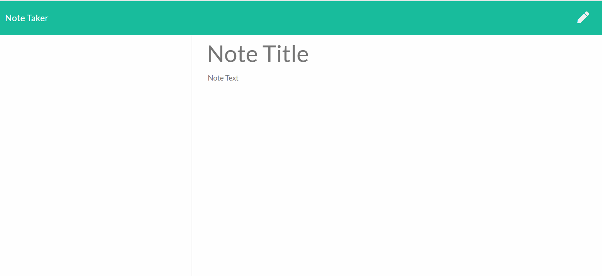

# noteTaker
* This application will allow you create, modify and delete notes.

## Table of Contents
* Install
* Instuctions for Use
* License
* Contributors
* Example
* Contact

## Installation
* click the live link to be taken to the application: https://notetakerv1.herokuapp.com/

## Instructions for Use
* Type note header, tab, insert note description. Click the save button to save the note, click the delete trashcan icon to delete. 

## License
* MIT

## Contributors
* ryanhun7er

## Example

## Contact

* @ryanhun7er

* ryanhwilkinson@icloud.com

* Nashville, TN

* https://github.com/ryanhun7er
